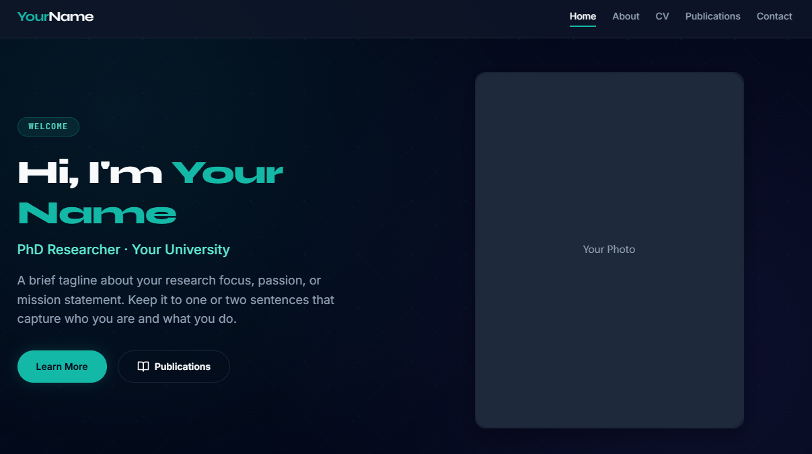

<div align="center">
  <h1>🎓 Academic Portfolio Template</h1>
  <p>A sleek, professional, and easily customizable purely static website template designed for academic researchers, PhD students, and developers.</p>

  <a href="#-features">Features</a> •
  <a href="#-getting-started-local-development">Getting Started</a> •
  <a href="#%EF%B8%8F-step-by-step-customization-guide">Customization</a> •
  <a href="#-hosting-on-github-pages-free-deployment">Deployment</a>

  <br><br>
   
</div>

---

## ✨ Features

- ⚡️ **No Build Step Required**: Pure HTML, CSS, and Vanilla JS. What you see is exactly what you get.
- 📝 **Markdown-Driven Content**: Write your CV, Publications, and bio in simple `.md` files. The template automatically parses and styles them.
- 🧩 **Reusable Components**: The Navigation bar and Footer are dynamically injected. Update them once, and they change everywhere.
- 🎨 **Sleek Modern Design**: Glassmorphism cards, glowing hover effects, smooth scrolling, and a subtle animated SVG background.
- 📱 **Fully Responsive**: Optimized for perfect viewing across mobile, tablet, and desktop devices.

---

## 🚀 Getting Started (Local Development)

Because this template fetches components dynamically (`navbar.html`, `footer.html`) and reads markdown files, **you cannot simply double-click `index.html`** to view the site (modern browsers block this due to CORS policies).

You need to run a lightweight local web server. Choose one of the following methods:

**Option 1: Node.js (Recommended)**
Open your terminal in the project folder and run:
```bash
npx serve
```
*Then open `http://localhost:3000`*

**Option 2: Python**
Open your terminal in the project folder and run:
```bash
# Mac/Linux
python3 -m http.server
# Windows
python -m http.server
```
*Then open `http://localhost:8000`*

**Option 3: VS Code "Live Server"**
If you use Visual Studio Code, install the extension **"Live Server"**. Right-click anywhere inside `index.html` and select **"Open with Live Server"**.

---

## 🛠️ Step-by-Step Customization Guide

### 1. 🌐 Global Setup (Navbar & Footer)
The Navigation Bar and Footer are shared components injected via JavaScript.
- **Navbar (`components/navbar.html`)**: Change your Logo text, modify links, or add new navigation items.
- **Footer (`components/footer.html`)**: Update the Copyright name, quick links, and social media profiles (Google Scholar, ORCID, GitHub, etc.) by modifying the `href` attributes.

### 2. ✍️ Changing the Content
To make text updates effortless, **all page content is driven by Markdown**. You do not need to edit HTML for the main body text!
Navigate to the `content/` folder:
- `home.md`: Your Home page summary and hero section opening text.
- `about.md`: Your extended bio and education highlights.
- `contact.md`: Your email, address, and institutional contact details.
- `cv.md`: Your Curriculum Vitae. Use `#` for major sections and `##` for entries. Separate entries with `---`.
- `publications.md`: Your academic papers. Use standard markdown link syntax: `[Paper Title](https://link.com)`.

> 💡 **SEO Tip**: Remember to update the `<title>` and `<meta name="description">` tags directly inside every HTML file (`index.html`, `about.html`, etc.).

### 3. 🖼️ Adding or Changing Images

There are two primary ways to manage images in this template:

**A. Core Profile Photos (Home & About)**
These integral photos are defined directly in the HTML structure.
1. Add your photo to your assets (e.g., `assets/images/profile.jpg`).
2. In `index.html`, locate the `` inside `<div class="hero__photo-wrapper">` and update the `src` attribute.
3. Repeat this process for the photo wrapper in `about.html`.

**B. Markdown Inline Images**
To insert diagrams, logos, or figures into your main text content, use standard markdown image tags inside the `.md` files located in the `content/` folder:
```markdown

```

### 4. 📄 Adding a New Page
Adding a completely new section (e.g., a "Projects" page) takes just a few steps:
1. **Create Markdown**: Make a new file like `content/projects.md` and write your content.
2. **Duplicate HTML**: Copy an existing page (like `about.html`) and rename it to `projects.html`.
3. **Update Metadata**: Open `projects.html` and change the `<title>` and `<meta name="description">` in the `<head>`.
4. **Link Content**: In `projects.html`, locate the main content wrapper (e.g., `<div id="about-content" data-src="content/about.md">`). Change its ID and point the `data-src` to your new markdown file:
   ```html
   <div id="projects-content" data-src="content/projects.md">
   ```
5. **Update Navbar**: Open `components/navbar.html` and add a new nav item link so visitors can reach the new page:
   ```html
   <a href="projects.html" class="nav__link">Projects</a>
   ```

### 5. 🎨 Changing the Color Scheme
This template utilizes CSS Variables, making global re-branding incredibly easy.
1. Open up `css/variables.css`.
2. Locate the `:root` pseudo-classes at the top. You will see primary colors (`--color-primary`), accent colors, and background colors.
3. Change the HEX codes. For example, to change from Teal to a deep Ruby Red:
   ```css
   --color-primary: #e11d48;
   --color-primary-hover: #be123c;
   ```
4. **Important for glowing shadows**: Ensure you also update the RGB alpha values (e.g., `--color-primary-alpha-20`) to match your new primary color. Use an online Hex to RGB converter to find your RGB values.

---

## 🌍 Hosting on GitHub Pages (Free Deployment)

Since this template requires no build step (no React, no bundlers), deploying it takes less than 2 minutes.

1. **Create a Repository**: In GitHub, create a new repo (e.g., `yourusername.github.io`).
2. **Upload Files**: Push or upload all files from this template directly into your repository's `main` branch.
3. **Enable Pages**: 
   - Go to your repository **Settings** → **Pages**.
   - Under "Build and deployment", select **Deploy from a branch**.
   - Choose `main` (or `master`) as your branch, leaving the folder as `/ (root)`.
   - Click **Save**.
4. **Live URL**: Wait a minute or two, and GitHub will provide your live website link!

> 🔁 **Updating**: Whenever you publish a new paper or update your CV, simply edit the markdown file locally and push to GitHub. Your live site will automatically update.
